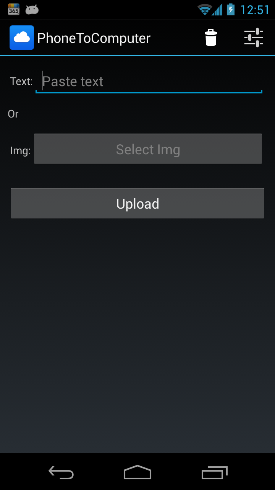
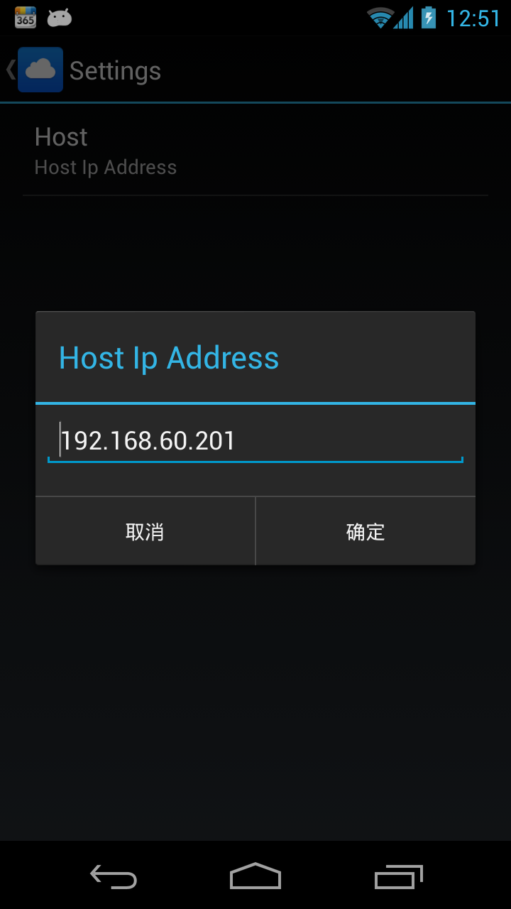

PhoneToComputerClient
=====================
upload text or image from your phone to your computer 
server side link [PhoneToComputerServer](https://github.com/dingzhihu/PhoneToComputerServer)

usage
======
1. install app
2. start server
3. open settings activity and set host ip
4. paste text or select img 
5. click upload
6. check server uploads directory 

screenshots
===========
1. 
2. 

